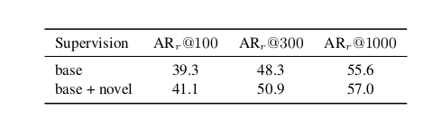
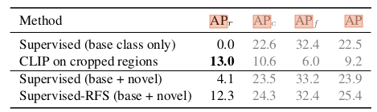
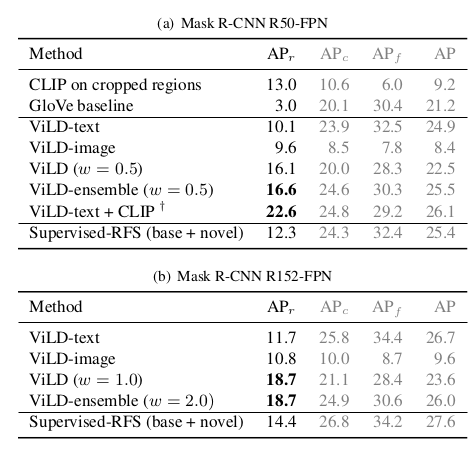
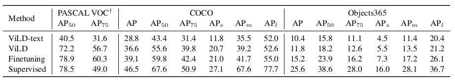
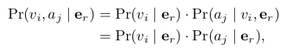
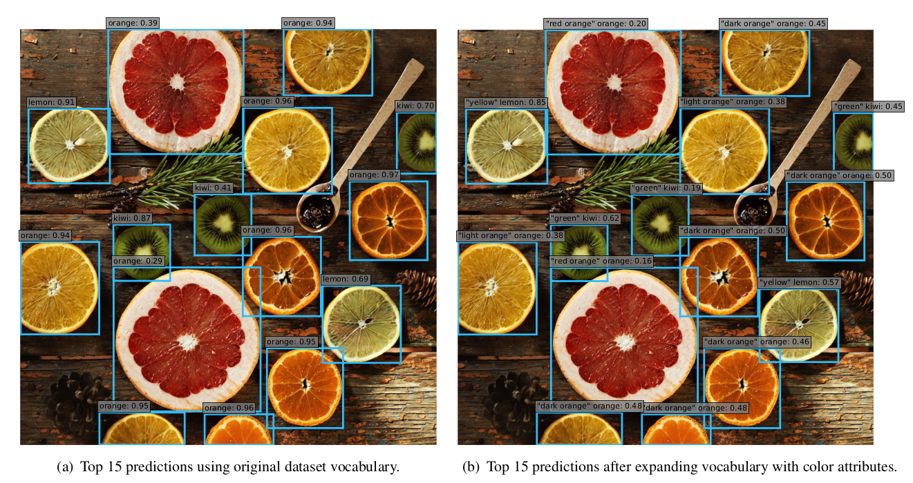
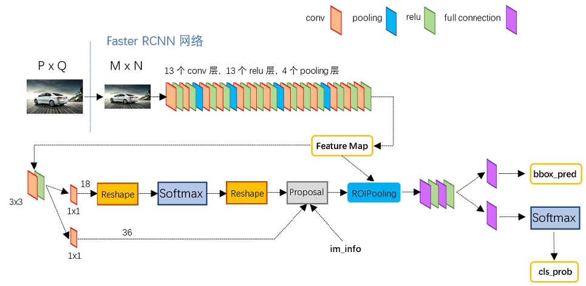
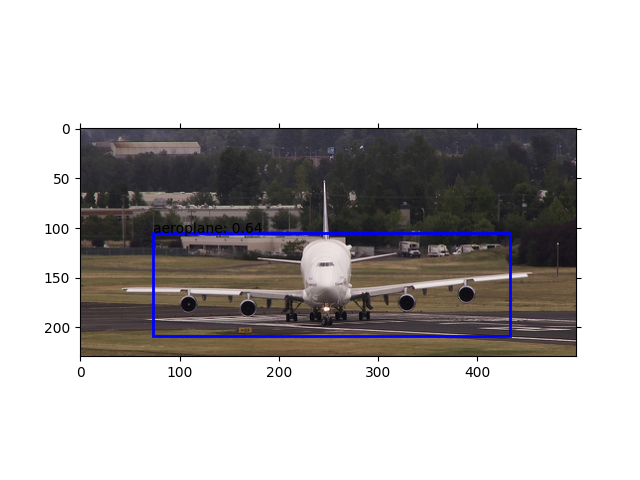
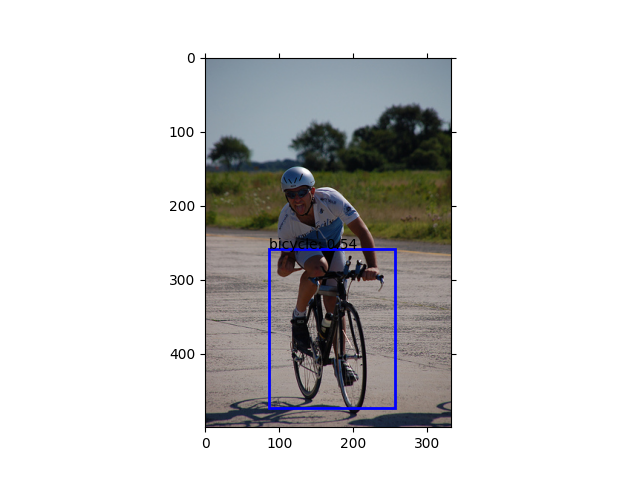

# Zero-Shot Detection via Vision and Language Knowledge Distillation论文复现代码
此工程用于复现论文Zero-Shot Detection via Vision and Language Knowledge Distillation中的部分效果

# [[paper]](https://arxiv.org/pdf/2104.13921)
## 主要环境
> Ubuntu 20.04

> pytorch 1.8.1

> clip

## python库依赖
先按照官网教程安装pytorch1.8.1再装执行
```cpp
pip intall -r requirements.txt
```

## clip模型介绍
论文中用到了openai开源的clip模型作为teacher model做KD(Knowledge Distillation)，clip由网上收集而来的4亿image-text pairs训练而成，意在将image以及其对应的text分别通过image-encoder和text-encoder映射到一个相互匹配的空间(embedding)，其中image-encoder负责用image生成region-embedding,text-encoder负责将带有标签的句子生成text-embedding，最后将两个embedding求余弦相似度再进行softmax得到各类的概率。

```cpp
result = (region_embedding @ text_embedding.T)/(torch.linalg.norm(region_embedding, ord=1)*torch.linalg.norm(text_embedding, ord=1))
result = nn.functional.softmax(result)
```

## Paper Review
### Background
- 现有的很多目标检测算法都只是能检测在训练数据里面的类别，所以要想检测到更多类别的目标一般都只能通过收集带有更多标注的图片。比如在LVIS数据集中有1203个类别，要为每一个类别找到足够的带标注的图片，特别是稀有的类别，将会带来非常大的花销。
- image-level representations 用于zero-shot classification已经有一定成果，但将object-level representations用于zero-shot object detection还是有很大的困难。
### Motivation
- 完成训练时不用到标注，推理时也可以检测到novel objects的zero-shot-detection
- 利用CLIP模型进行Kownledge Distillation，训练出一个可以检测novel objects的student model
### Method
在<a href="#paper">论文复现过程</a>里详细说明
### Experiment Results
- AR on novel categories


***<center>region proposal network train with base categories ***vs*** base+novel categories</center>***

Observation:就算没有训练novel categories的数据，模型的性能也不会有很大的下降，所以一个好的region proposal network非常重要。

- AP of CLIP

***<center>Using CLIP for zero-shot detection</center>***

Observation:使用CLIP中的text_encoder在LVIS数据集上可以取得比监督学习更好的AP<sub>r</sub>，但是其他metric较差。

- AP of VILD

***<center>ViLD outperforms the supervised learning counter-
part on novel categories</center>***
Observation:VILD-ensemble(VILD-text+VILD-image)在novel categories上取得的检测效果在测试中排第二，已经超越了监督学习，其中第一的VILD-text+CLIP速度比ViLD-ensemble要慢得多，所以VILD-ensemble(VILD-text+VILD-image)收益最高。

- Generalization ability of ViLD

***<center>Generalization ability of the detector trained with ViLD on LVIS</center>***

Observation:ViLD在测试的数据集之间的泛化能力只比fintuning和监督学习差一点，但是也取得了很好的效果。

- Systematic expansion of dataset vocabulary

用其他属性(a = {a1,..., aq})拓展了数据集的vocabulary(v = {v1,...,vp })，其中假设a与v相互独立，则对于每个region_embedding e<sub>r</sub>，其同时包含v<sub>i</sub>和a<sub>j</sub>的概率为:



而,


这样我们就把长度为***p***的vocabulary扩展到***pxq***。


***<center>Systematic expansion of dataset vocabulary with colors</center>***
上图中向水果的数据集中加入了颜色属性
### Conclusions
ViLD在LVIS上取得了很好的zero-shot detection效果以及很强的泛化能力，是'长尾'类别检测提供了一个不需要大量标注的可行办法。

## <a id="paper">论文复现过程</a>
### Faster_RCNN training
论文中采用的是Mask_RCNN来生成proposals

而本次复现使用的是用ResNet-50-FPN作为backbone的单类Faster_RCNN，Faster_RCNN用修改过的pytorch源码实现，并且用ROIalign替代ROIpooling(排除了ROIpooling因量化而对bbox regression造成的误差)，没有用到Mask_RCNN中的FCN支路，在保证检测效果的同时又减少了训练成本。训练时，为达到class-agnostic的效果，所有背景的label设置为0，其它所有类为1。

### Crop regions && Get image_embedding
目标由Faster_RCNN定位,提取ROIalign之后的proposals和features，**直接提取出来的proposals和features还不能直接用，要经过比例调整、边界限制，再筛除较小的proposal和features**，再将proposals和1.5倍大小的proposals经过crop和resize后输入CLIP模型的image_encoder中获得两种image_embdding，两种image_embdding进行相加后归一化得到最后的image_embdding，

```cpp
image_embedding = model.encode_image(proposal)
image_embedding = image_embedding/torch.linalg.norm(image_embeddings, ord=1, dim=2)
```
crop和resize操作由clip.load()函数返回的preprocess函数进行，用到1.5倍大小的proposals是因为其含有更多的信息，但是由于显存限制，这里只用到原尺寸的proposals。

### Generate text_embedding
首先用将训练的类别与'a photo of a {类名}'组合输入text_encoder获得text_embedding(每一个类对应一个text_embedding)，text_encoder本质是一个transformer模型，用于将sentence映射到高维的空间，寻找句子中词之间的联系，**由于CLIP模型中没有'backgound'对应的数据，故代码里用了一个1x512的可训练tensor代替，再加入text_embedding中一起计算,用nn.Parameter()来确保backgound向量可以被当作参数保存。**
```cpp
self.background = nn.Parameter(torch.rand(1, 512))
```
### Get proposals label
采用IOU的方式来确定label，当IOU超过一定阈值则视为包含当前目标，代码中只为base categories确定label。**但是这同时引申出了另一个待解决的问题，所有包含目标的proposal都有可能获得较高的置信度，不利于最终boundingbox的筛选**。

### Calculate text_loss
得到text_embedding之后，为了找到可以在高维空间中与之对应的region_embedding，故将上一步中的features输入自行搭建的网络中，得到输出为1x512的向量(text_embedding以及image_embedding的维度也为1x512)。而为了计算text_embedding和region_embedding的相似度，论文里面采用了计算余弦相似度的方法，其中两个向量的余弦相似度越大代表两向量越相似，**下面用sim指代余弦相似度**。将单个feature和所有的text_embedding计算余弦相似度，结果保存成一个向量，将向量整体除于温度T后(**T是Kownleadge Distillation里面的知识，用于改变teacher model中小概率结果对student model的影响程度**)，对向量以及proposals对应的label求交叉熵，便得到了proposal中每一类的概率，其中主要过程的实现代码如下:
```cpp
import torch
Zr = sim(region_embedding, text_embeddings)
loss_t = torch.nn.CrossEntropyLoss()
loss = loss_t(Zr/T, torch.nonzero(label)#torch.nonzero()用于确定label的位置
```

### Calculate image_loss
image_loss的计算相对简单，直接计算image_embedding和region_embeddin相减的一范数即可

### Train VILD
训练的时候将数据分为两类，base类和novel类，base类用于计算text_loss和image_loss，novel类则只用于计算image_loss，因为计算image_loss不需要label，而最后训练好的模型可以检测到novel类里面的目标，也就体现了zero-shot-learning的特性

### Experiment Result
用aeroplane和bicycle两类数据进行训练，其中areoplane视为base categories，bicycle视为novel categories，训练中之用到了aeroplane的标注，proposal数量为30(节省显存)，训练结果如下：



## Code example
参考VILD_Train.py文件中的函数，需要用到的参数有：

- model_path：训练好的模型的位置

- train_class:训练时base class和novel class的数量之和

- dataset_path:voc数据集的位置
```cpp
import vocDataset
from VILD import VILD
import matplotlib.pyplot as plt
import torch
import torchvision.transforms as transforms

def VILD_eval(model_path="VILD.pt", train_class=2, dataset_path="/home/llrt/文档/VOCdevkit/VOC2012"):
    device = "cuda" if torch.cuda.is_available() else "cpu"
    # 主要作用是将图片数据转成tensor传入显存
    preprocess = vocDataset.get_transform(False)
    postprocess = transforms.ToPILImage()
    # 加载数据
    dataset = vocDataset.vocData(
        data_path=dataset_path, train_class=train_class, transform=preprocess)
    loader = torch.utils.data.DataLoader(
        dataset, batch_size=1, shuffle=False, num_workers=4,
        collate_fn=collate_fn, pin_memory=True)

    # 加载模型
    model = VILD(train_class)
    model.load_state_dict(torch.load(model_path))
    model.to(device)
    model.eval()

    for imgs, targets in loader:
        images = list([img.to(device) for img in imgs])
        target = [{k: v for k, v in target.items()}
                  for target in targets]

        # 防止images为空导致出错
        if(int(len(images)) == 0 or int(len(targets[0]["boxes"])) == 0):
            continue
        # 清空每一次显示的矩形框，防止残留
        plt.cla()
        fig = plt.imshow(postprocess(images[0].to('cpu')))
        result, proposals = model(images, target)
        for p, r in zip(proposals, result):
            for pro, re in zip(p, r):
                for bbox, core in zip(pro, re):
                    if(core < 0.9):
                        continue
                    fig.axes.add_patch(vocDataset.bbox_to_rect(bbox, 'blue'))
                    plt.text(bbox[0], bbox[1],vocDataset.classes[i-1]+': '+str(round(core, 2)))
        plt.pause(1)


if __name__ == '__main__':
    VILD_eval(train_class=2)
```

## TODO LIST
- 解决训练时类别数目多不收敛问题
- 多batch_size训练(目前只能为一)
- 优化loss计算，得到更准确的boundingbox
- 目前很多参数还是直接以数组的相识直接用于公式计算，应设置为可调变量

